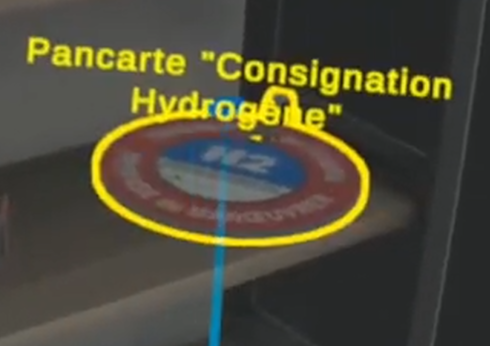
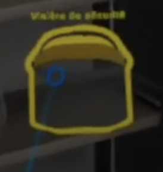
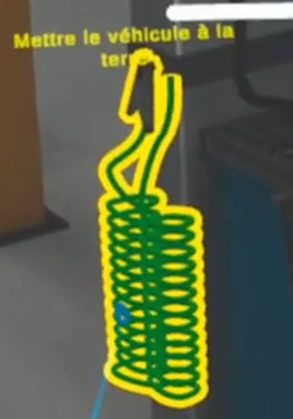
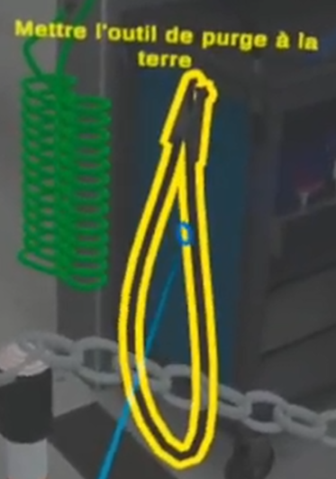
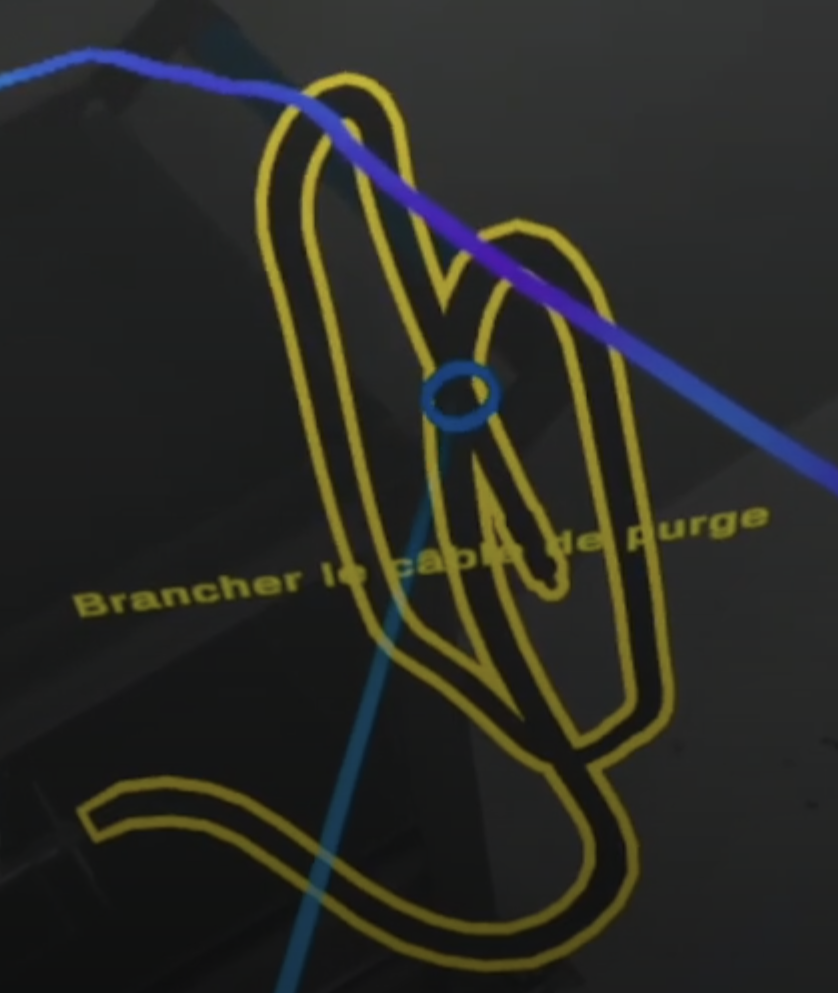
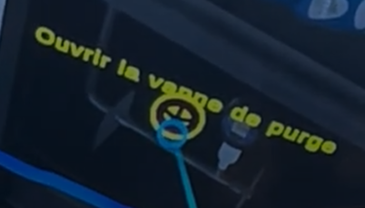
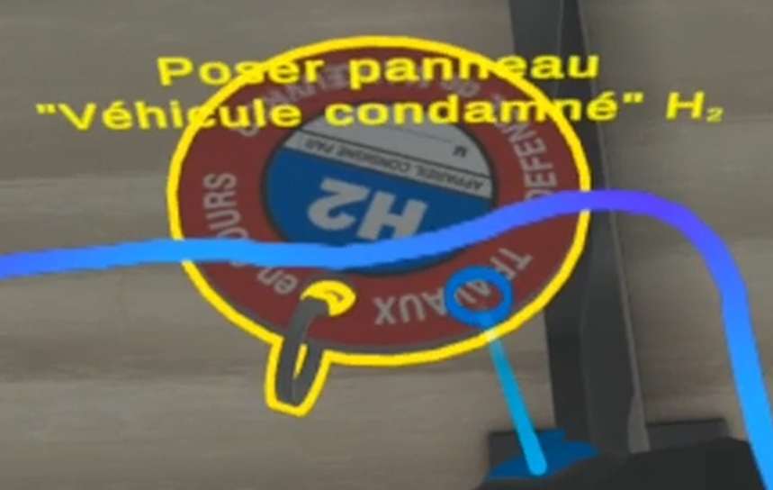

# Effectuer la  consignation hydrogène 

## Préparer la consignation hydrogène

### Signaliser
Marquer clairement la zone de travail avec ce panneau de sécurité pour indiquer qu'une intervention est en cours.

### Equiper les EPI
En tant qu'opérateur, vous devez porter les équipements de protection individuelle appropriés.
#### -Gants APEX
Mettez des gants APEX pour une protection contre les risques chimiques et thermiques.

#### -Visière de sécurité
Protègez-vouus le visage contre les projections et les éventuelles émissions de gaz avec la visière de sécurité.

## Dépressuriser
### Mettre le véhicule à la terre
Connecter une mise à la terre pour éviter toute accumulation de charge électrostatique.

### Mettre l'outils de purge à la terre
Vous devez vous assurez que l'outil de purge est également mis à la terre pour éviter toute étincelle.

### Connecter le câble de purge sur le véhicule
Fixez correctement le câble de purge pour évacuer l'hydrogène en toute sécurtié

### Vérification de la mise en pression de l'outils de purge & vérifier que le flexible  est bien en pression
Assurez-vous que l'outil de purge est bien sous pression et que le flexible est correctement connecté et fonctionnel.

### Vérifier la chute de pression 
Surveiller la pression pour confirmer que l'hydrogène est bien purgé.

### Retirer l'outils de purges
Une fois la purge complète, déconnecter prudemment l'outil de purge.

## Poser la pancarte "Véhicule condamnée H"
Posez une pancarte signalant que le véhicule est condamné et qu'aucune intervention non autorisée ne doit avoir lieu.

## Vérifier qu'il ne reste pas d'hydrogène
Utilisez un détecteur de gaz pour confirmer l'absence totale d'hydrogène résidue
