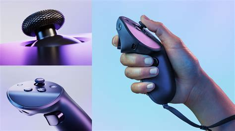
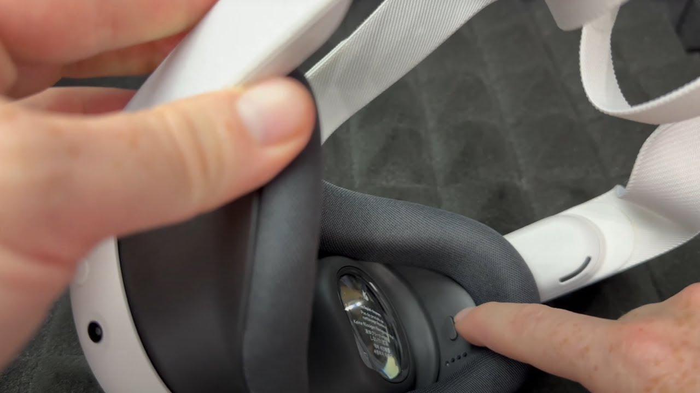
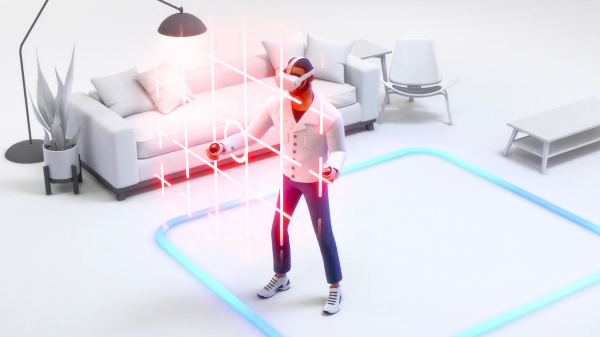

# Initiation à la VR

Vous comptez vous essayer à l’exercice mais n’avez jamais pratiqué la Réalité Virtuelle ? Voici quelques informations pour vous aider à vous lancer.

## Mise en place

### Matériel

#### Casque

Pour commencer, il vous faudra un casque de Réalité Virtuelle. Le modèle qui vous a probablement été fourni est un casque de la famille _Meta Quest_, qui a la particularité de fonctionner en _standalone_, c’est-à-dire sans nécessiter d’ordinateur pour fonctionner. Il vous suffit donc de le charger et de l’allumer s’il ne l’est pas déjà. C’est au travers de ce casque que vous pourrez voir le monde virtuel.

Figure 1 : Casque Meta Quest 3

#### Manettes

Les manettes sont au nombre de deux. Elles nécessitent des piles pour fonctionner. Elles vous permettront d’interagir avec le monde virtuel. Pour les allumer, il vous suffit d’appuyer sur n’importe quel bouton une fois le casque allumé.

Figure 2 : Une manette Meta Quest 3 et comment la tenir

#### Utilisation avec des lunettes

Si l’utilisateur porte des lunettes, il est possible de les garder en les plaçant sous le casque. Il faut pour cela régler la distance entre les lentilles et les yeux.

Figure 3 : Ajustement des lunettes sous le casque

### Environnement

Pour une expérience optimale, il est recommandé de se placer dans un environnement dégagé, sans obstacles, afin de pouvoir vous déplacer librement.

Si ce n’est pas déjà configuré, il vous faudra dessiner une zone de jeu. Pour cela, suivez les instructions affichées dans le casque.

Figure 4 : Zone de jeu

## Utilisation

### Contrôles

Pour cliquer sur un élément d’interface comme un bouton, pointez-le avec l’une de vos manettes et appuyez sur la gâchette au niveau de votre index.
